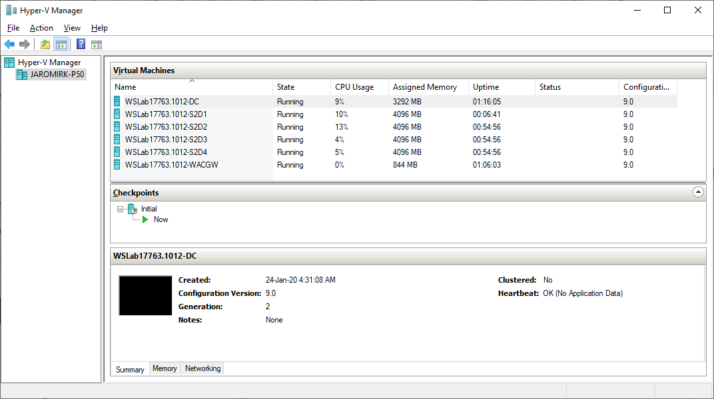
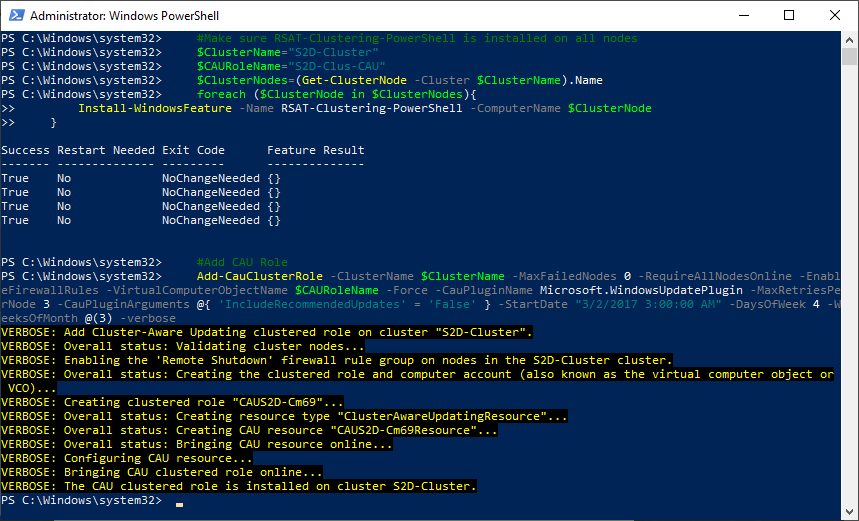
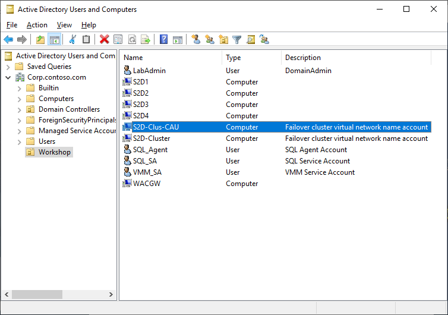
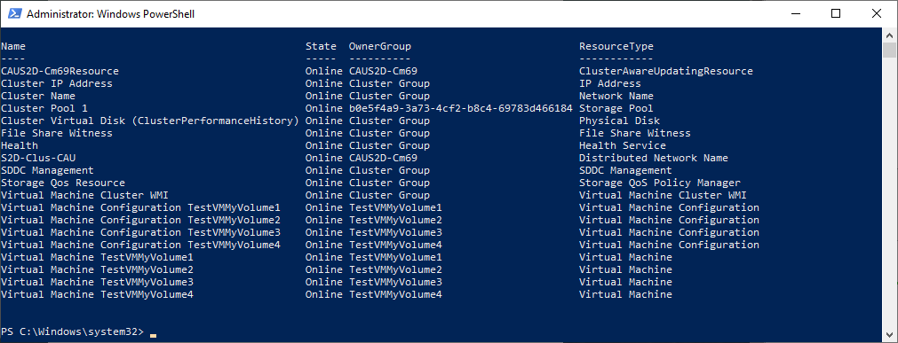
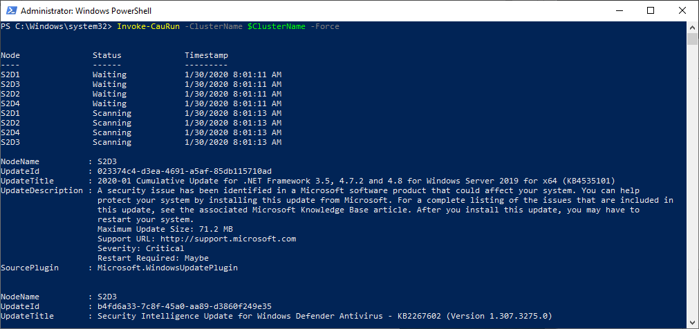
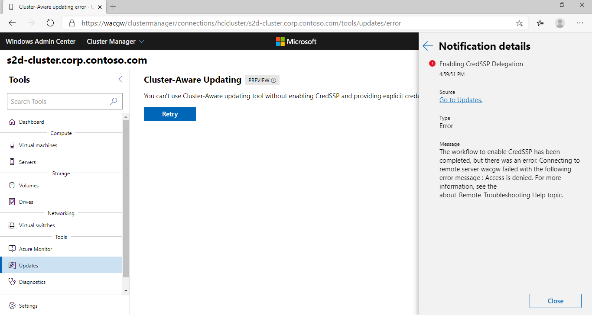

<!-- TOC -->

- [S2D And Cluster-Aware Updating](#s2d-and-cluster-aware-updating)
    - [About the lab](#about-the-lab)
    - [LabConfig for Windows Server 2019](#labconfig-for-windows-server-2019)
    - [Prereqisites](#prereqisites)
    - [The Lab](#the-lab)
        - [Setup Self-Updating mode](#setup-self-updating-mode)
        - [Explore what was configured](#explore-what-was-configured)
        - [Invoke CAU Scan](#invoke-cau-scan)
        - [Invoke CAU Run](#invoke-cau-run)
        - [Get-CAURun](#get-caurun)
        - [Get-CAUReport](#get-caureport)
        - [Add CAU to Windows Admin Center](#add-cau-to-windows-admin-center)

<!-- /TOC -->

# S2D And Cluster-Aware Updating

## About the lab

Following lab will setup 4 node S2D cluster and will guide you through setting up Cluster-Aware Updating in Self-updating mode



## LabConfig for Windows Server 2019

```PowerShell
#Labconfig is same as default for Windows Server 2019, but with Nested Virtualization

$LabConfig=@{ DomainAdminName='LabAdmin'; AdminPassword='LS1setup!'; Prefix = 'WSLab2019-'; SwitchName = 'LabSwitch'; DCEdition='4' ; Internet=$true ;AdditionalNetworksConfig=@(); VMs=@()}

1..4 | % {$VMNames="S2D"; $LABConfig.VMs += @{ VMName = "$VMNames$_" ; Configuration = 'S2D' ; ParentVHD = 'Win2019Core_G2.vhdx'; SSDNumber = 0; SSDSize=800GB ; HDDNumber = 12; HDDSize= 4TB ; MemoryStartupBytes= 4GB ; NestedVirt=$true }}

$LabConfig.VMs += @{ VMName = 'WACGW' ; ParentVHD = 'Win2019Core_G2.vhdx' }
 
```

## Prereqisites

Run all scripts from DC (or Windows 10 Management machine)

Note: script does not follow all best practices. For best practices visit [S2D Hyperconverged Scenario](/Scenarios/S2D%20Hyperconverged/).

```PowerShell
# variables
    $ClusterNodes="S2D1","S2D2","S2D3","S2D4"
    $ClusterName="S2D-Cluster"

#ask for VHD (you can provide nano or core)
    [reflection.assembly]::loadwithpartialname("System.Windows.Forms")
    $openFile = New-Object System.Windows.Forms.OpenFileDialog -Property @{
        Title="Please select parent VHDx." # You can copy it from parentdisks on the Hyper-V hosts somewhere into the lab and then browse for it"
    }
    $openFile.Filter = "VHDx files (*.vhdx)|*.vhdx"
    If($openFile.ShowDialog() -eq "OK"){
        Write-Host  "File $($openfile.FileName) selected" -ForegroundColor Cyan
    } 
    if (!$openFile.FileName){
        Write-Host "No VHD was selected... Skipping VM Creation" -ForegroundColor Red
    }
    $VHDPath = $openFile.FileName

# Install features for management
    $WindowsInstallationType=Get-ItemPropertyValue -Path 'HKLM:\SOFTWARE\Microsoft\Windows NT\CurrentVersion\' -Name InstallationType
    if ($WindowsInstallationType -eq "Server"){
        Install-WindowsFeature -Name RSAT-Clustering,RSAT-Clustering-Mgmt,RSAT-Clustering-PowerShell,RSAT-Hyper-V-Tools
    }elseif ($WindowsInstallationType -eq "Server Core"){
        Install-WindowsFeature -Name RSAT-Clustering,RSAT-Clustering-PowerShell,RSAT-Hyper-V-Tools
    }elseif ($WindowsInstallationType -eq "Client"){
        #Install RSAT tools
        $Capabilities="Rsat.ServerManager.Tools~~~~0.0.1.0","Rsat.FailoverCluster.Management.Tools~~~~0.0.1.0","Rsat.ActiveDirectory.DS-LDS.Tools~~~~0.0.1.0"
        foreach ($Capability in $Capabilities){
            Add-WindowsCapability -Name $Capability -Online
        }
    }

# Install features on servers
    Invoke-Command -computername $ClusterNodes -ScriptBlock {
        Install-WindowsFeature -Name "Hyper-V","Failover-Clustering","Hyper-V-PowerShell","RSAT-Clustering-PowerShell" #RSAT is needed for Windows Admin Center if used
    }
#IncreaseHW Timeout for virtual environments to 30s
    Invoke-Command -ComputerName $ClusterNodes -ScriptBlock {Set-ItemProperty -Path HKLM:\SYSTEM\CurrentControlSet\Services\spaceport\Parameters -Name HwTimeout -Value 0x00007530}

#restart all servers since failover clustering in 2019 requires reboot
    Restart-Computer -ComputerName $ClusterNodes -Protocol WSMan -Wait -For PowerShell

#create cluster
    New-Cluster -Name $ClusterName -Node $ClusterNodes
    Start-Sleep 5
    Clear-DNSClientCache


#add file share witness
    #Create new directory
        $WitnessName=$ClusterName+"Witness"
        Invoke-Command -ComputerName DC -ScriptBlock {new-item -Path c:\Shares -Name $using:WitnessName -ItemType Directory}
        $accounts=@()
        $accounts+="corp\$($ClusterName)$"
        $accounts+="corp\Domain Admins"
        New-SmbShare -Name $WitnessName -Path "c:\Shares\$WitnessName" -FullAccess $accounts -CimSession DC
    #Set NTFS permissions
        Invoke-Command -ComputerName DC -ScriptBlock {(Get-SmbShare $using:WitnessName).PresetPathAcl | Set-Acl}
    #Set Quorum
        Set-ClusterQuorum -Cluster $ClusterName -FileShareWitness "\\DC\$WitnessName"

#Enable S2D
    Enable-ClusterS2D -CimSession $ClusterName -Verbose -Confirm:0

#Create Volumes
    $NumberOfNodes=$ClusterNodes.count
    1..$numberofNodes | ForEach-Object {
        New-Volume -CimSession $ClusterName -FileSystem CSVFS_ReFS -StoragePoolFriendlyName S2D* -Size 10TB -FriendlyName "MyVolume$_"
    }

#Create VMs
    $CSVs=(Get-ClusterSharedVolume -Cluster $ClusterName).Name
    foreach ($CSV in $CSVs){
        $CSV=($csv -split '\((.*?)\)')[1]
        $VMName="TestVM$($CSV)"
        New-Item -Path "\\$ClusterName\ClusterStorage$\$CSV\$VMName\Virtual Hard Disks" -ItemType Directory
        Copy-Item -Path $VHDPath -Destination "\\$ClusterName\ClusterStorage$\$CSV\$VMName\Virtual Hard Disks\$VMName.vhdx" 
        New-VM -Name $VMName -MemoryStartupBytes 512MB -Generation 2 -Path "c:\ClusterStorage\$CSV\" -VHDPath "c:\ClusterStorage\$CSV\$VMName\Virtual Hard Disks\$VMName.vhdx" -CimSession ((Get-ClusterNode -Cluster $ClusterName).Name | Get-Random)
        Add-ClusterVirtualMachineRole -VMName $VMName -Cluster $ClusterName
    }
    #Start all VMs
    Start-VM -VMName * -CimSession (Get-ClusterNode -Cluster $clustername).Name

#Install Windows Admin Center
$GatewayServerName="WACGW"
#Download Windows Admin Center if not present
if (-not (Test-Path -Path "$env:USERPROFILE\Downloads\WindowsAdminCenter.msi")){
    $ProgressPreference='SilentlyContinue' #for faster download
    Invoke-WebRequest -UseBasicParsing -Uri https://aka.ms/WACDownload -OutFile "$env:USERPROFILE\Downloads\WindowsAdminCenter.msi"
    $ProgressPreference='Continue' #return progress preference back
}
#Create PS Session and copy install files to remote server
Invoke-Command -ComputerName $GatewayServerName -ScriptBlock {Set-Item -Path WSMan:\localhost\MaxEnvelopeSizekb -Value 4096}
$Session=New-PSSession -ComputerName $GatewayServerName
Copy-Item -Path "$env:USERPROFILE\Downloads\WindowsAdminCenter.msi" -Destination "$env:USERPROFILE\Downloads\WindowsAdminCenter.msi" -ToSession $Session

#Install Windows Admin Center
Invoke-Command -Session $session -ScriptBlock {
    Start-Process msiexec.exe -Wait -ArgumentList "/i $env:USERPROFILE\Downloads\WindowsAdminCenter.msi /qn /L*v log.txt REGISTRY_REDIRECT_PORT_80=1 SME_PORT=443 SSL_CERTIFICATE_OPTION=generate"
}

$Session | Remove-PSSession

#add certificate to trusted root certs
start-sleep 10
$cert = Invoke-Command -ComputerName $GatewayServerName -ScriptBlock {Get-ChildItem Cert:\LocalMachine\My\ |where subject -eq "CN=Windows Admin Center"}
$cert | Export-Certificate -FilePath $env:TEMP\WACCert.cer
Import-Certificate -FilePath $env:TEMP\WACCert.cer -CertStoreLocation Cert:\LocalMachine\Root\

#Configure Resource-Based constrained delegation
$gatewayObject = Get-ADComputer -Identity $GatewayServerName
$computers = (Get-ADComputer -Filter {OperatingSystem -Like "Windows Server*"}).Name

foreach ($computer in $computers){
    $computerObject = Get-ADComputer -Identity $computer
    Set-ADComputer -Identity $computerObject -PrincipalsAllowedToDelegateToAccount $gatewayObject
}

#Install Edge
$ProgressPreference='SilentlyContinue' #for faster download
Invoke-WebRequest -Uri "https://aka.ms/edge-msi"
#Install Edge
Start-Process -Wait -Filepath msiexec.exe -Argumentlist "/i $env:UserProfile\Downloads\MicrosoftEdgeEnterpriseX64.msi /q"
#start Edge
start-sleep 5
& "C:\Program Files (x86)\Microsoft\Edge\Application\msedge.exe"
 
```

## The Lab

### Setup Self-Updating mode

Following code will just make sure RSAT-Clustering is installed on every node of cluster. It will also configure Cluster-Aware Updating to perform updates every third Thursday in the month without admin interaction. Notice Parameters MaxFailedNodes, RequireAllNodesOnline and EnableFirewallRules.

```PowerShell
    #Make sure RSAT-Clustering-PowerShell is installed on all nodes
    $ClusterName="S2D-Cluster"
    $CAURoleName="S2D-Clus-CAU"
    $ClusterNodes=(Get-ClusterNode -Cluster $ClusterName).Name
    foreach ($ClusterNode in $ClusterNodes){
        Install-WindowsFeature -Name RSAT-Clustering-PowerShell -ComputerName $ClusterNode
    }
    #Add CAU Role
    Add-CauClusterRole -ClusterName $ClusterName -MaxFailedNodes 0 -RequireAllNodesOnline -EnableFirewallRules -VirtualComputerObjectName $CAURoleName -Force -CauPluginName Microsoft.WindowsUpdatePlugin -MaxRetriesPerNode 3 -CauPluginArguments @{ 'IncludeRecommendedUpdates' = 'False' } -StartDate "3/2/2017 3:00:00 AM" -DaysOfWeek 4 -WeeksOfMonth @(3) -verbose
 
```



### Explore what was configured

```PowerShell
$ClusterName="S2D-Cluster"
dsa.msc
Get-ClusterResource -Cluster $ClusterName
Get-CauClusterRole -ClusterName $ClusterName
```






### Invoke CAU Scan

To scan what updates are available, you can use following command

```PowerShell
$ClusterName="S2D-Cluster"
Invoke-CauScan -ClusterName $ClusterName
 
```


### Invoke CAU Run

To patch cluster you can run following command

```PowerShell
$ClusterName="S2D-Cluster"
Invoke-CauRun -ClusterName $ClusterName -Force
 
```



### Get-CAURun

If there is patching in progress, you can query it with Get-CAURun

```PowerShell
$ClusterName="S2D-Cluster"
Invoke-CauRun -ClusterName $ClusterName
 
```


### Get-CAUReport

After patching is done, you will be able to see last result.

```PowerShell
$ClusterName="S2D-Cluster"
Invoke-CauReport -ClusterName $ClusterName
 
```


### Add CAU to Windows Admin Center

```PowerShell
#Configure Resource-Based constrained delegation for CAU object
$GatewayServerName="WACGW"
$CAURoleName="S2D-Clus-CAU"
$gatewayObject = Get-ADComputer -Identity $GatewayServerName
$CAURoleObject = Get-ADComputer -Identity $CAURoleName
Set-ADComputer -Identity $CAURoleObject -PrincipalsAllowedToDelegateToAccount $gatewayObject
 
```

Navigate to https://wacgw and add S2D-Cluster. If you will navigate to Updates, you can also run CAU from Windows Admin Center

Unfortunately this is what we get now.


